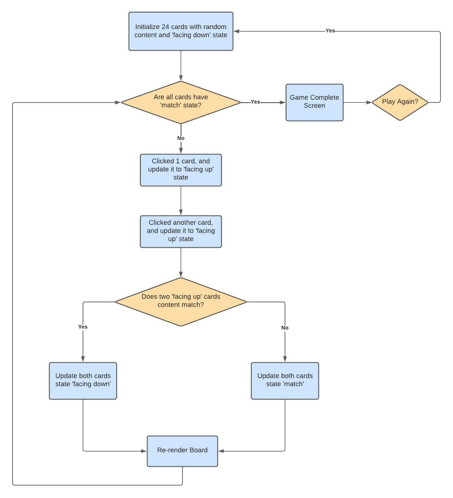

# memory-game
- At the start of the game, the user is presented with a grid of 24 facedown cards.
- Each card looks identical face down, but has a face-up value that is matched by only one
other card on the table.
- When the user clicks a card, it flips over revealing its value.
- When the user clicks the next card, its value is revealed and then compared against the
other face up card. If they are equal, both cards disappear. If they are different, they flip
back down.
- The game is continued until there are no cards left.

## Available Scripts

In the project directory, you can run:

### `npm start`

Runs the app in the development mode.\
Open [http://localhost:3000](http://localhost:3000) to view it in your browser.

The page will reload when you make changes.\
You may also see any lint errors in the console.

### `npm test`

Launches the test runner in the interactive watch mode.\
See the section about [running tests](https://facebook.github.io/create-react-app/docs/running-tests) for more information.

### `npm run build`

Builds the app for production to the `build` folder.\
It correctly bundles React in production mode and optimizes the build for the best performance.

## Architecture / Framework
This app is been implemented by using React & Redux.
### The core react components are
1. components/Board
   - This component connect redux store and renders the game board.
   - This component runs the game rule to compare two flipped cards, and either flip them back to down state or remove them.
2. components/Card
   - This component displays the card, handles 3D flip transition.
   - This component handles the card click event and update card status.
### Redux actions and reducers
1. INIT_BOARD: Initialize 24 cards with random content.
2. TOGGLE_CARD: Toggle card status with facing up or down.
3. UPDATE_CARDS_STATUS: Update two facing up cards status to match or facing down.

